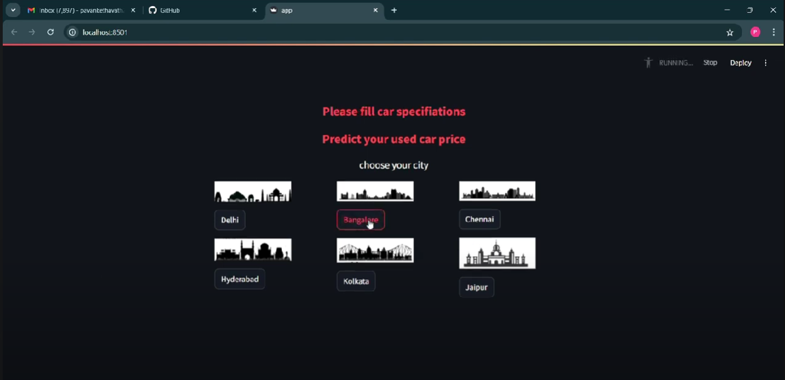
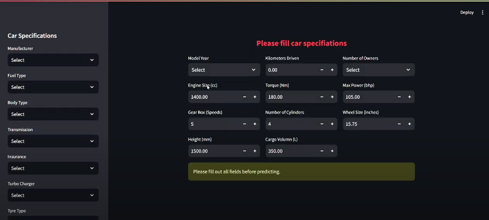
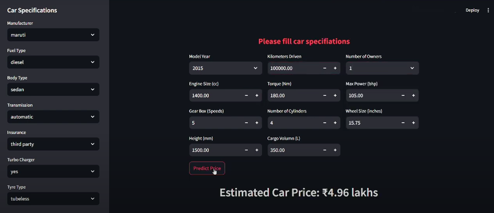

# Car Dheko - Used Car Price Prediction Application

This project is a **Streamlit-based web application** that predicts the price of used cars based on a comprehensive analysis of structured and unstructured car listing data scraped from CarDekho. By implementing a robust preprocessing pipeline and a fine-tuned Random Forest model with **GridSearchCV**, the application offers users accurate(**R² score 0.9028**) and data-driven car price estimates based on attributes such as **city,fuel type, body type, transmission, manufacturer, and more**. 

[Watch Demo Video](https://www.youtube.com/watch?v=W-DZWO-53uU)

## Problem Statement

The "Car Price Prediction Application" addresses the challenge of providing reliable pricing estimates for used cars. As data can be unstructured and inconsistent, the project focuses on **cleaning, encoding, and scaling** to ensure data integrity, followed by **hyperparameter tuning** to maximize model accuracy. The final model enables precise pricing predictions to support both car buyers and sellers in the used car market.

## Key Highlights

- **Data Cleaning and Feature Engineering**: Handles unstructured data, extracts meaningful features, and ensures consistency across the dataset.
- **Optimal Model Selection**: Tested multiple models, with **Random Forest** achieving the best performance:
  - **R² Score**: 0.895, explaining over 90% of variance in car prices.
  - **Mean Absolute Error (MAE)**: 1.23
  - **Mean Squared Error (MSE)**: 13.12
- **Hyperparameter Optimization**: Leveraged **Grid Search** to improve the model's R² score to 0.9028, indicating the model explains approximately 90.28% of price variance.

## Business Use Cases

- **Used Car Dealerships**: Provide data-driven pricing for better customer interactions.
- **Private Sellers and Buyers**: Help individual users make informed pricing decisions.
- **Market Analysis**: Gain insights into factors affecting car prices.

## Features

### 1. **Data Preprocessing**
   - **Unstructured Data Processing**: Transfored data scraped from CarDekho into a structured format.
   - **Feature Engineering**: Extracts critical attributes from complex, nested data fields.
   - **Scaling and Encoding**: Utilizes **MinMax Scaler** for numerical attributes and one-hot encoding for categorical attributes.
   - The preprocessing pipeline is implemented in the `Data_preprocessing.ipynb` notebook.

### 2. **Model Development**
   - **Model Evaluation**: Compared various models, with Random Forest showing the best performance metrics.
   - **Grid Search Optimization**: Enhanced the Random Forest model’s parameters, yielding:
     - **R² Score**: 0.9028
     - **MAE**: Significantly reduced from initial testing.
   - The model development and training process is detailed in the `Car_price_prediction.ipynb` notebook.

### 3. **User Interface with Streamlit**
   - **Interactive Web Application**: Built with **Streamlit** for easy user interaction.
   - **User Inputs**: Accepts car features such as fuel type, body type, transmission, manufacturer, and other specifications.
   - **Prediction Display**: Outputs the predicted car price based on the input parameters.
- 
- 
- 
## Application Workflow

1. **Data Loading and Cleaning**: Reads raw data, cleans, and encodes it for analysis.
2. **Model Training and Tuning**: The Random Forest model is trained, tuned using Grid Search, and evaluated for optimal performance.
3. **Price Prediction**: The Streamlit app provides an interface for users to enter car features, and the model returns an estimated price.

## Technologies Used

- **Python**: Core language for data processing and modeling.
- **Streamlit**: Web framework for building the interactive user interface.
- **Pandas** and **NumPy**: For data manipulation and preprocessing.
- **scikit-learn**: For model building, tuning, and evaluation.
- **Pickle**: For saving the trained model for deployment.

---

## Project Files

1. **`Data_preprocessing.ipynb`**:
   - Preprocesses the raw car dataset, including feature extraction, cleaning, and encoding.
   - Outputs a structured dataset ready for model training.

2. **`Car_price_prediction.ipynb`**:
   - Contains code for training and optimizing the machine learning model.
   - Saves the trained model and scaler as pickle files (`car_price_model.pkl` and `scaler.pkl`).

3. **`app.py`**:
   - The Streamlit application for user interaction.
   - Loads the trained model and scaler, takes user inputs, and outputs the predicted car price.

---

## Model Performance

| Model           | MAE   | MSE    | R² Score |
|-----------------|-------|--------|----------|
| Random Forest   | 1.23  | 13.12  | 0.905    |
| **Optimized Random Forest** | - | - | **0.9028** |

The optimized Random Forest model achieved a high R² score of **0.9028**, meaning it explains around 90.28% of the variance in car prices, with **reduced MAE and MSE** from the initial model version.

---

## How to Run
1. **Clone the repository**:
   ```bash
   git clone <repository_url>
   cd car-price-prediction

  2. **Ensure you have the following libraries installed**:  streamlit pandas scikit-learn

 3. **Run the Streamlit Application**:
   - To run the application, use the following command:
     ```bash
     streamlit run app.py
     ```
  ## Contributing:

- Contributions are welcome! Feel free to submit **pull requests** or open **issues** for any bugs, feature requests, or improvements.
- Let me know if you need any further changes or assistance!  


